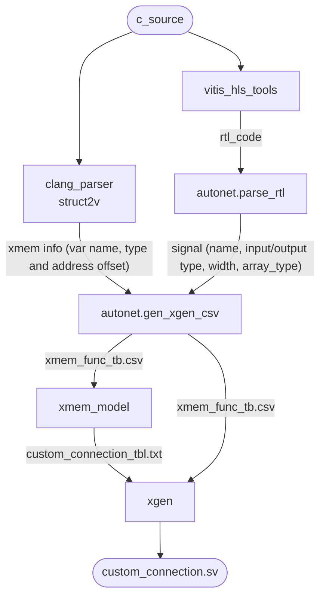

### xgen user guide

Feature: Automatic generate the verilog code from xmem_func.csv and custom_connection_tbl.txt. The custom_connection_tbl file contains the bank address of each signal

Usage: pyhon3 xgen.py --xmem-data [xmem_func.csv] --xmem-model [custom_connection_tbl.txt] --export-common-dir [export_commom_folder] --export-conn-dir [export_conn_folder]

```console
python3 xgen.py --xmem-data example/xmem_func.csv --xmem-model example/custom_connection_tbl.txt --export-common-dir example --export-conn-dir example --export-tb-dir example --export-tb-xnet-dir example --export-sim-dir example
```

